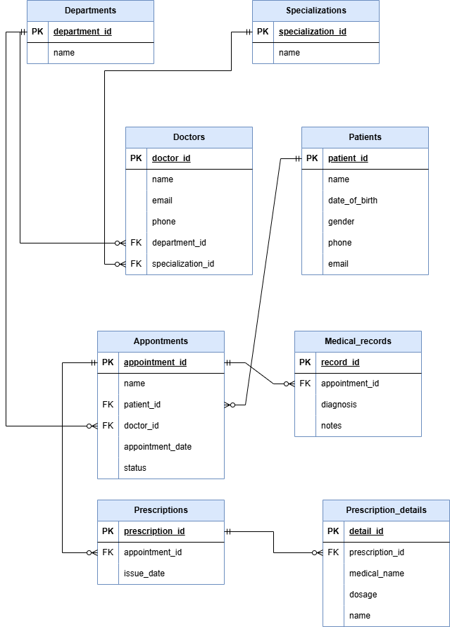

🏥 Clinic Booking System Database
This project is a MySQL-based relational database designed for managing clinic operations such as doctor appointments, patient records, prescriptions, and more.

📌 Objective
Design and implement a full-featured relational database for a real-world use case — Clinic Booking System — using only MySQL.

📘 Features
Track doctors, their departments and specializations

Manage patients and their appointments

Maintain medical records and prescriptions

Organize medications and prescription details

🗃️ Entities & Relationships
The system consists of the following core tables:

departments

specializations

doctors

patients

appointments

medical_records

prescriptions

prescription_details

These tables are linked using 1-to-many and 1-to-1 relationships to ensure data integrity and consistency.

🧩 Entity-Relationship Diagram (ERD)
Below is the ERD for the system showing how the tables are related:

📷 Insert your ERD image here

💡 Tip: Upload the image (e.g., clinic_erd.png) to your project folder and link it like this:

md
Copy
Edit

🏗️ Database Setup
Run the following SQL file to create all tables and insert sample data:

pgsql
Copy
Edit
mysql -u your_username -p your_database < schema.sql
📂 File Structure
pgsql
Copy
Edit
📁 clinic-database/
├── clinic.sql          # Contains all CREATE TABLE 
├── clinic_database.png      # ERD image
└── README.md           # Project documentation

📌 Sample Constraints Used
Primary keys (PK)

Foreign keys (FK)

NOT NULL

UNIQUE

Appropriate data types for fields (e.g., DATE, VARCHAR, INT)

✅ Example Use Cases
Book appointments for patients

View a patient’s medical history

Generate prescriptions for specific visits

Track doctors by department and specialization

📬 Contact
For any questions, feel free to reach out at [dukemochama21@gmail.com].